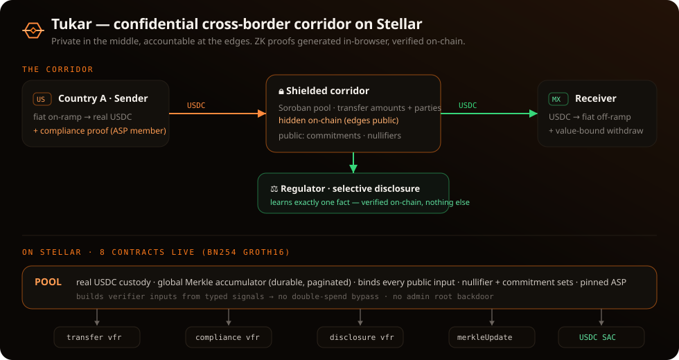

# Tukar

> **A private way to send money home, on Stellar.**
> Fiat in → shielded USDC transfer → fiat out. Private in the middle, accountable at the edges.

Tukar is a **consumer cross-border payments app**: the everyday job of sending
money home to family, made private. It ships as **mobile-first Sender and Receiver
apps** (`/sender`, `/receiver`) with **real fiat in and out** at the edges, and a
**private cross-border remittance corridor** underneath. Built for the
[Stellar Hacks: Real-World ZK](https://dorahacks.io/hackathon/stellar-hacks-zk)
hackathon, and entered in the APAC Grand Finale's **Payments & Consumer
Applications** category, because that is what it is: a way for a person to pay
another person across a border. Money enters in one country, crosses the corridor
with its **amount and counterparties hidden on-chain in the shielded transfer leg**,
and exits as local fiat in another country. (Deposits and withdrawals are public at
the edges, by Privacy-Pools design; see
[the privacy model](docs/SECURITY.md#privacy-model--anonymity-set-honest-scope).)
At each **edge**, zero-knowledge **compliance proofs** keep the corridor auditable
without ever exposing the private payment graph.

Tukar's moat is not the payment, it is the **compliant on-chain privacy**. A
consumer sends money privately, and a regulator can still check a fact on-chain via
selective disclosure. That is the part a plain wallet or a plain mixer does not have.

Stellar's whole reason for existing is moving real money across borders. Tukar
takes that exact rail and makes it confidential *and* compliant, a direct
implementation of Stellar's privacy strategy and the
[Privacy Pools whitepaper](https://privacypools.com/whitepaper.pdf)
(visible deposits/withdrawals, private transfers, ASP + selective disclosure for
compliance).

### Where Tukar sits in Stellar's privacy stack

Stellar's privacy stack has two complementary tiers, and Stellar itself draws the
line ([Confidential Tokens preview](https://stellar.org/blog/developers/developer-preview-confidential-tokens-on-stellar),
Jun 2026):

- **Confidential, not anonymous.** OpenZeppelin's **Confidential Tokens** (Noir +
  Nethermind UltraHonk) hide **balances and amounts** but keep **sender/recipient
  visible**. Ideal for treasury, payroll, institutional settlement, with *known*
  counterparties.
- **Anonymous (privacy pool).** The tier that *also* hides the counterparties. The
  Confidential Tokens post names **Stellar Private Payments (SPP)** here: *"privacy
  pool implementations … shield **both the parties and the amounts**."* **Tukar is
  in this tier.** Its shielded transfer leg hides amount *and* who-paid-whom, which
  is exactly the cross-border-remittance threat model (a corridor must not leak the
  payment graph).

So Tukar isn't an alternative to Confidential Tokens. It's the **more-private
remittance tier** of the same stack, and it ships the *same* compliance primitives
Stellar shipped (auditor/selective disclosure + an ASP allow/deny policy), built
independently during the hackathon. Honest scope: Confidential Tokens is an official,
audit-in-progress preview; Tukar is a hackathon implementation of the privacy-pool
tier, with its ZK verified live on testnet.

### What makes Tukar different

Most on-chain privacy projects stop at *"hide the payment."* Tukar is built for one
specific job, **cross-border remittance**, and three things set it apart from generic
private-payment or encryption-infra work:

1. **Compliant privacy, not just privacy.** Private in the middle, *accountable at the
   edges*. Every deposit carries an ASP compliance proof that **authenticates the
   depositor** (`sourceKey` pinned to `field(from)`, so you can't deposit as someone
   else), and a holder can prove **one fact** to a regulator via selective disclosure,
   verified on-chain. A corridor a regulator can audit is a corridor a licensed anchor
   can actually run. That's the wedge a pure mixer doesn't have.
2. **Remittance end-to-end, not a generic shield.** Fiat-in → shielded crossing →
   fiat-out to **local currency**, across **10 corridors**. The privacy serves the
   payment; the payment isn't an afterthought to the privacy.
3. **Oracle-gated settlement.** The off-ramp rate is read **on-chain from Reflector**
   and *gates fund release* (min-receive on the median of 5 records, **fail-closed**).
   The privacy layer is bound to real-world FX, so funds never move on a stale or
   manipulated rate. No pure-privacy project ties settlement to an on-chain oracle.

Put together: a **privacy-pool remittance corridor with ASP compliance and selective
disclosure**, a combination with no catalog equivalent. The one-line wedge:
**private for users AND provable to regulators, on the chain built for cross-border
money.** So "this already exists (LumenShade / Moonlight / Fairblock)" misses the
combination: those are privacy *primitives* or infra on other models, not a compliant
remittance corridor on Stellar's anchor rail with in-circuit ASP compliance, **four**
contract-verified disclosure types, and a load-bearing settlement oracle. For an honest
map of the neighbours (Confidential Tokens, LumenShade, Moonlight, Fairblock) and exactly
where Tukar differs and where it stays composable, see
[`docs/COMPETITIVE.md`](docs/COMPETITIVE.md).

### Market, users, and business

**Who it's for.** The end users are the migrant worker sending money home and the family
receiving it in local currency. The paying customer is the licensed anchor or PSP that
needs a private corridor it can still audit. B2B2C, so Tukar doesn't acquire consumers one
at a time.

**Market.** Remittances into low- and middle-income countries reached about **$669B in
2023**, and sending $200 still costs about **6.2%** on average, more than double the UN's
3% target and barely changed in a decade. Public stablecoin rails cut that fee but expose
every amount and counterparty; pure privacy tools hide it but can't answer a regulator. A
licensed corridor needs both, which is the gap Tukar fills.

**Model.** Tukar is the private settlement leg between anchors. Revenue is a thin take-rate
on settlement volume, paid by the anchors and PSPs that route through the corridor.
Go-to-market is one high-volume lane with one licensed anchor first, then more corridors;
the post-hackathon path is a Stellar Community Fund build award on the same rail.

**Honest status.** This is a testnet build with no users or revenue yet. The above is the
opportunity and the model, not traction.

Sources: [World Bank, Migration and Development Brief 39 (Dec 2023)](https://www.worldbank.org/en/news/press-release/2023/12/18/remittance-flows-grow-2023-slower-pace-migration-development-brief)
for remittance volume; [World Bank Remittance Prices Worldwide](https://remittanceprices.worldbank.org/)
for the average cost of sending $200.

---



## TL;DR for judges

- **What:** a private cross-border remittance corridor. Real testnet USDC enters,
  crosses with amount + counterparties **hidden on-chain in the shielded transfer**
  (deposit/withdraw edges public by design), exits, with **ZK compliance proofs at
  the edges** and **selective disclosure** to regulators.
- **ZK is load-bearing:** seven Circom/Groth16/BN254 circuits do the real work,
  four core (shielded transfer, ASP compliance, selective disclosure, trustless
  tree update) plus three selective-disclosure variants (threshold, aggregate,
  two-sided range). Without them the product does not exist.
- **It runs on Stellar. 8 contracts live on testnet, all exercised:**

  | Contract | Role | Verified on testnet |
  |---|---|---|
  | [pool](https://stellar.expert/explorer/testnet/contract/CBIYQACYOKDBPYDGU7DMSHPGJEWP2ZRETXDVOTC5HTU5RJBGDK2MHTWJ) | orchestration, token custody, root/nullifier/commitment sets | deposit · withdraw · disclose · double-spend rejected |
  | [disclosure verifier](https://stellar.expert/explorer/testnet/contract/CAYGURQQK3LCQSQLD4FMPXVYGDXHL3K4GAM6URLCEXCXL2JCORLJ4W4V) | selective disclosure to regulator | `verify` → `true`; tampered → `InvalidProof` |
  | [transfer verifier](https://stellar.expert/explorer/testnet/contract/CACHZSWXJJAGW5UKA5KME73YV5BVYOXFKGT5KUSXIAS3JJJM4QY3PUNE) | shielded JoinSplit | `verify` → `true` |
  | [compliance verifier](https://stellar.expert/explorer/testnet/contract/CDXYGM37TRH4JXBZKVPOOEIDX5L7NUVUXJ63E5BHW2W7O4SKQMWXBCG2) | ASP allow/deny | `verify` → `true` |
  | [merkleUpdate verifier](https://stellar.expert/explorer/testnet/contract/CCA3T54EKN3RJD77LRQJ2P664ZF3U4STPRQIK4IIQWPACRLXB3JS3X6H) | trustless root advance | `verify` → `true`; fake root → `InvalidProof` |
  | [threshold verifier](https://stellar.expert/explorer/testnet/contract/CDGOSIZQIMACRLIE76SQKKHUOKURGTGC4T2CKM2K62YP6463QR2KLHVR) | disclosure: amount ≤ a figure (amount hidden) | `verify` → `true` |
  | [aggregate verifier](https://stellar.expert/explorer/testnet/contract/CCTN437J4BX6S4JDMGUZFS2IEHV4ECHHK4ZLMM3N6VU5IIX2777AZJYA) | disclosure: Σ portfolio ≤ cap, bound to an on-chain audit request | `verify` → `true` |
  | [range verifier](https://stellar.expert/explorer/testnet/contract/CDUONEVPPH7WI7EPSXZE3YXEF4FHHJM7HFJOTZBCJNJSUG26UMENUPQW) | disclosure: two-sided band `lower ≤ amount ≤ upper` | `verify` → `true` |

  **Contract addresses (Stellar testnet).** Copy-paste form of the table above:

  ```
  pool                 CBIYQACYOKDBPYDGU7DMSHPGJEWP2ZRETXDVOTC5HTU5RJBGDK2MHTWJ
  transfer verifier    CACHZSWXJJAGW5UKA5KME73YV5BVYOXFKGT5KUSXIAS3JJJM4QY3PUNE
  compliance verifier  CDXYGM37TRH4JXBZKVPOOEIDX5L7NUVUXJ63E5BHW2W7O4SKQMWXBCG2
  disclosure verifier  CAYGURQQK3LCQSQLD4FMPXVYGDXHL3K4GAM6URLCEXCXL2JCORLJ4W4V
  merkleUpdate verifier CCA3T54EKN3RJD77LRQJ2P664ZF3U4STPRQIK4IIQWPACRLXB3JS3X6H
  threshold verifier   CDGOSIZQIMACRLIE76SQKKHUOKURGTGC4T2CKM2K62YP6463QR2KLHVR
  aggregate verifier   CCTN437J4BX6S4JDMGUZFS2IEHV4ECHHK4ZLMM3N6VU5IIX2777AZJYA
  range verifier       CDUONEVPPH7WI7EPSXZE3YXEF4FHHJM7HFJOTZBCJNJSUG26UMENUPQW
  USDC (SAC, testnet)  CAT6F6HX4B2DBPSS4SIZ257IYSMKDKRJSEGIQTKBDS7LOFRMDXVGFVA2
  ```

  Network: **Stellar testnet** (`Test SDF Network ; September 2015`). The same ids
  live in [`deployments/testnet.json`](deployments/testnet.json).

- **🌐 Live site:** **https://tukar-six.vercel.app**. A landing page; hit
  **Launch the live demo** (or go straight to
  [`/demo`](https://tukar-six.vercel.app/demo)). There, **Send** builds compliance
  + amount-binding proofs in your browser and **deposits real USDC on-chain**
  (watch the pool's commitment count rise); the receiver off-ramps to fiat; and a
  regulator audit produces a disclosure proof that is **verified on-chain by the
  live Stellar verifier**. **No install needed.** One click on **Use testnet key**
  activates a real built-in testnet key (or **connect Freighter** to sign with your
  own). On-chain actions are gated on that explicit connection, with no silent signing.
  Pick a **destination corridor**, 10 of them (Indonesia, Philippines, Vietnam,
  Thailand, India, Mexico, Brazil, Argentina, Nigeria, Colombia), and the off-ramp
  converts at a **live** USD→local exchange rate.
  For **Mexico, Brazil, Argentina and Thailand** (the first SEA corridor with an
  on-chain FX oracle), the receiver's revealed fiat figure is
  computed **on-chain by the pool contract itself**, which cross-contract-reads
  [Reflector](https://reflector.network), Stellar's decentralized SEP-40 FX oracle
  (`pool.offramp_quote` → Reflector `lastprice`), so the number comes from our
  Soroban contract reading a partner oracle on-chain, not a client-side hardcode
  (the other corridors fall back to a public FX API). For those four corridors the
  withdraw also carries an **optional min-receive gate**: it passes the live quote as
  `min_local_out`, and the pool **re-reads Reflector on-chain at settlement** and
  refuses to release below ~99% of it (`SlippageExceeded`), failing closed if the feed
  is down, so the oracle is **load-bearing for fund movement**, not just display. A
  plain withdraw (no gate) still settles in USDC and never touches the oracle.
- **One unified app (`webapp/`).** Alongside the vanilla site, the product is now a
  single **Next.js** app in [`webapp/`](webapp/) that unifies the landing page, the
  full **`/demo`** corridor console, and **four role-specific apps** over the same
  live pool and the same in-browser proving:
  - **Sender** (`/sender`) and **Receiver** (`/receiver`) — mobile-first consumer apps:
    Sender funds the corridor and builds the shielded deposit; Receiver holds/receives
    a note and off-ramps to local fiat.
  - **Regulator** (`/regulator`) — an auditor dashboard that requests and verifies the
    selective-disclosure proofs (exact, threshold, aggregate, range) on-chain.
  - **Operator** (`/operator`) — a corridor-operator dashboard over pool activity and
    state.

  The vanilla [`frontend/`](frontend/) site (landing + demo) still exists and shares
  the **same live pool** and contracts; the two are alternate front ends, not forks.
- **Run locally in 3 commands:** `npm install && npm run circuit:all && npm run serve`
  → http://localhost:8000.
- **Gasless, natively:** fees can be sponsored by a relayer via Stellar's native
  **fee-bump** (CAP-15), the no-gated-token alternative to a Launchtube paymaster.
  Proven on testnet: `npm run demo:feebump` (a tx signed by one account, fee paid by
  another). See [`docs/ALTERNATIVES.md`](docs/ALTERNATIVES.md) for how each
  externally-gated integration (Launchtube, Mercury, passkeys, SEP-24) maps to a
  native alternative and what's verifiable here.
- **Demo video (self-hosted, always available):**
  **▶ [Watch the narrated walkthrough](https://tukar-six.vercel.app/deck)** plays on
  **slide 8** of the pitch deck, or open the raw file directly at
  **[`/demo-id.mp4`](https://tukar-six.vercel.app/demo-id.mp4)**. A ~90-second recording of the
  **real on-chain flow** (connect → on-chain deposit → off-ramp via Reflector → claim →
  disclosure verified on-chain → tampered claim rejected on-chain), narrated with a natural voice.
  It's recorded end-to-end from the live app by Playwright (`scripts/record-shortcut.mjs`),
  narrated by `edge-tts`, and muxed with ffmpeg; the on-chain waits are sped up, not cut. The
  caption and voiceover script lives in [`docs/DEMO_VO_SUBTITLES.md`](docs/DEMO_VO_SUBTITLES.md),
  and a slide-by-slide deck script in [`docs/DECK_SCRIPT.md`](docs/DECK_SCRIPT.md).

## What the ZK is doing (load-bearing)

The zero-knowledge is not decorative. It is the entire product. Seven circuits,
all **Groth16 over BN254**, generated **client-side in the browser (WASM)** and
verified **on-chain** by Soroban contracts using Stellar's native BN254 host
functions (Protocol 25/26). Secrets never leave the device. Four are the core; the
other three are selective-disclosure variants (see the disclosure family below).

| Circuit | Proves | Where |
|---|---|---|
| **transfer** | Note ownership, correct nullifiers (no double-spend), Merkle inclusion, value conservation | the private transfer |
| **compliance** | Source ∈ ASP allow-list and ∉ deny-list, bound to the transfer | corridor edges |
| **disclosure** | A confidential commitment opens to a disclosed amount, bound to an audit request | regulator view |
| **merkleUpdate** | Inserting a leaf into a *known* `old_root` yields exactly `new_root` | trustless tree advance |
| **thresholdDisclosure** | A commitment's amount is ≤ a threshold, without revealing the amount | regulator view |
| **aggregateDisclosure** | The sum of 1..5 confidential payments is ≤ a cap, bound to an on-chain audit request | regulator view |
| **rangeDisclosure** | A commitment's amount is in a two-sided band `lower ≤ amount ≤ upper`, amount hidden | regulator view |

The **disclosure** circuit is Tukar's differentiator: the selective-disclosure
layer that turns "private payments" into *compliant* private payments. See
[`docs/ARCHITECTURE.md`](docs/ARCHITECTURE.md) for the full design.

Selective disclosure comes in **four types**, all compiled, soundness-tested, and
live on-chain with each proof **bound through the pool to a real deposit**:

1. **Exact** ([`disclosure.circom`](circuits/disclosure.circom)) — a commitment opens
   to a disclosed amount.
2. **Threshold** ([`thresholdDisclosure.circom`](circuits/thresholdDisclosure.circom))
   — the amount is **≤ a reporting figure without revealing the exact amount**, the
   predicate real reporting rules actually want. `npm run test:threshold` → **4/4**
   (under/at-threshold proves with the amount kept private; over-threshold and a
   mismatched commitment are unprovable). Wired into the demo's Regulator step
   (*"≤ Threshold · amount hidden"*) and verified live on the deployed verifier:
   `≤ $1000` proves with the amount hidden; `≤ $100` on a $500 payment is honestly
   shown unprovable.
3. **Aggregate** ([`aggregateDisclosure.circom`](circuits/aggregateDisclosure.circom))
   — the **sum of 1..5 confidential payments is ≤ a cap** without revealing any amount
   (a periodic CTR-style report in ZK). Completeness is enforced on-chain: the proof is
   bound to an `auditContextHash` an **auditor registers on-chain** for the full
   required set (`register_audit_request`), and `disclose_aggregate` rejects any
   unregistered hash, so a holder can't report a cherry-picked subset.
   `npm run test:aggregate` → **6/6**.
4. **Two-sided range** ([`rangeDisclosure.circom`](circuits/rangeDisclosure.circom)) —
   the amount is in a reportable band `lower ≤ amount ≤ upper`, amount hidden.
   `npm run test:range` → **5/5** (in-band proves, boundaries inclusive, below/above and
   a wrong opening unprovable).

The threshold, aggregate, and range verifiers were deployed **additively** on top of
the four core contracts, giving **8 contracts** (pool + 7 verifiers) live on testnet.

---

## What's real (not mocked)

This started as a demo and was hardened, increment by increment, through many
adversarial self-audit rounds into a **security-hardened testnet** system (not
professionally audited, see the caveats below). What that means concretely:

- **Real USDC, real custody.** The pool custodies a **real testnet USDC asset**
  (SAC [`CAT6F6HX…FVA2`](https://stellar.expert/explorer/testnet/contract/CAT6F6HX4B2DBPSS4SIZ257IYSMKDKRJSEGIQTKBDS7LOFRMDXVGFVA2),
  issuer `GC7SWGHR…SY3B`). `deposit` moves the **actual amount** you type into the
  pool; `withdraw` releases it.
- **Amount ↔ commitment binding.** `deposit` requires a second (disclosure) proof
  that the commitment **opens to exactly the deposited amount**, so privacy can't
  decouple the hidden note value from the tokens that moved.
- **Correct withdraw value semantics.** A withdraw carries a **negative**
  `publicAmount` (`r − amount`, value *leaving* the shielded set) and the pool
  binds the released amount to that field-negative, so it cannot be told to release
  more than the proof authorizes (`AmountNotBound`).
- **Binding closes the double-spend bypass.** The pool never accepts a pre-built
  public-input vector; it builds the verifier's inputs from the typed signals
  itself, so the spent nullifiers / recorded commitments / root / amount are
  *exactly* the ones the proof attests. A valid proof with tampered nullifiers →
  `InvalidProof`.
- **Fully trustless tree, no admin backdoor.** The root advances **only** via
  `register_root_verified` with a `merkleUpdate` proof (registering a fake root
  with a real proof → `InvalidProof`). The admin root-override was removed; the
  commitment count is idempotent (no double-count).
- **Reliable global Merkle accumulator.** `register_root_verified` requires
  `old_root == current_root`, so the tree is a single append-only accumulator (not
  a per-session view), and inserting from a stale root is rejected. The ordered leaves
  live in **durable contract state**, read via `leaves()` / `leaf_range(start,count)`
  / `leaf_count` (paginated, so it scales), so any client reconstructs the exact
  tree from on-chain **state**, reload-safe and multi-user-correct, with no
  dependency on RPC event retention. Leaf/root entries get their TTL extended on
  each insert (long-lived pools stay readable), and the client auto-retries the
  concurrent-deposit race. Verified live: leaves accumulate 0→1→2→3→4 across
  independent sessions/clients.
- **Compliance that authenticates the depositor (key-on-`from`).** The compliance
  circuit's `sourceKey` is a public input the pool pins to
  `field(from) = keccak256(from XDR) mod r`, and `deposit` `require_auth(from)`s. So
  the proof shows **this authenticated depositor** is in the ASP allow-list (and not
  deny-listed), not merely that *some* approved source exists. An unapproved key
  can't deposit. (The shared demo key is allow-listed so the no-install demo works;
  the design is correct for real-wallet users.)
- **Real trusted setup.** All seven proving keys are derived from the **Hermez
  perpetual Powers-of-Tau ceremony** (`powersOfTau28_hez_final_14.ptau`). Phase-1
  has no locally-known toxic waste. Verifiers + pool were regenerated together so
  keys and verifiers stay in sync.
- **On-chain Poseidon (proven).** The pool exposes
  [`poseidon_hash(a,b)`](contracts/pool/src/poseidon.rs), a **circomlib-exact**
  Poseidon computed on-chain from BN254 Fr host ops. Live, `poseidon_hash(1,2)`
  returns `0x115cc0f5…4417189a`, exactly circomlibjs `poseidon([1,2])`. We measured
  it at ~13.6M CPU/hash, so a depth-10 insert (~135M) exceeds the per-tx budget,
  which is *why* the tree is advanced with a cheap `merkleUpdate` SNARK rather than
  hashed on-chain. See [`onChainPoseidonFinding`](deployments/testnet.json).
- **Optional real wallet.** [`frontend/wallet.js`](frontend/wallet.js) adds an
  optional **Freighter** connection (sign deposits with your own wallet, with a
  one-click testnet faucet); the embedded throwaway key stays the no-install
  default.
- **Reload-survivable notes.** Your notes persist in `localStorage` (keyed by
  pool), so a page reload restores them, and because the tree reconstructs from
  durable on-chain state, a deposited note stays **withdrawable after you close the
  tab** (verified live: deposit → reload → withdraw the restored note).
- **Bearer notes (true P2P).** A shielded note *is* the spendable asset, so the
  receiver can **export it as a portable string (and a scannable QR)** and hand it
  to anyone, who **imports it on a different device and withdraws**. No shared
  account, no server. The tree reconstructs from chain anywhere, and the imported
  note's leaf index is resolved on-chain by commitment at withdraw time (verified
  live: export → fresh wallet → import → on-chain withdraw). Demo keys only. The
  string carries the note's secret, so treat it like cash.
- **Payment requests (the reverse direction).** The receiver can ask for money:
  generate a request (a string **and a QR**, carrying just an amount + the payee
  address, no secrets), and the sender **loads it to pre-fill the corridor send
  form** and fulfills it with a normal shielded deposit (verified live: request →
  load → on-chain deposit). Together with bearer notes this closes the P2P loop.
  Request money one way, hand over a spendable note the other.
- **Adversarially self-audited.** A read-only audit (see
  [`docs/SECURITY.md`](docs/SECURITY.md)) hardened the contract. The verifier's
  return is now asserted (no fail-open), the deposit amount range and tree capacity
  are bounded, withdraw resolves the note's real on-chain index, and the **withdraw
  recipient is bound into the proof** (the contract recomputes `keccak256(recipient ‖
  amount)`, so a withdraw proof can't be replayed to a different recipient), and
  **compliance now authenticates the depositor** (key-on-`from`, above). The only
  remaining caveat is that the *shared demo key's* secret is public, so the public
  demo itself isn't access-controlled, though the design is correct for real wallets.

**52/52 pool unit tests** + **6/6 circuit-soundness** (plus disclosure-variant
soundness suites: threshold **4/4**, two-sided range **5/5**, aggregate **6/6**) + a
19-point [threat model](docs/SECURITY.md). CI runs the pool tests, the in-browser
proving flow, and the circuit-soundness suite on every push (`.github/workflows/ci.yml`).

**Live real-click e2e (`npm run test:e2e`): 11/11** against the deployed site (or a
local `npm run serve`). Playwright drives genuine clicks through the full on-chain
flow (deposit → reveal → withdraw → disclose → tamper-rejected), on-chain ASP
forge-rejection, corridor switching, graceful junk-input handling, UI gating, and a
**cross-wallet double-spend**: export a bearer note, reset to a second holder, import,
and the on-chain `NullifierUsed` (`#2`) rejects the second spend, all with zero
uncaught page errors. Back-to-back txns on the shared demo key ride a
rebuild-and-retry that self-heals transient testnet faults (sequence races,
`TRY_AGAIN_LATER`, RPC 5xx); a contract revert like that double-spend `#2` is
deterministic and is never retried, so it surfaces immediately. See
[docs/TESTING.md](docs/TESTING.md) §6.

**Trusted setup is independently verifiable:** all seven deployed proving keys
provably derive from the real Hermez ceremony. `snarkjs zkey verify <r1cs>
pot14_hez.ptau <zkey>` returns `ZKey Ok!` for every circuit (TESTING.md §5).

---

## Still honestly simplified

- **Fiat anchors are mocked in the demo flow** (the corridor assumes testnet USDC at
  the edges). But the anchor **SEP protocols are really integrated**. Tukar publishes
  a [SEP-1 `stellar.toml`](frontend/.well-known/stellar.toml), and `npm run sep:anchor`
  authenticates (SEP-10 JWT) and opens a real interactive USDC on-ramp (SEP-24) against
  SDF's reference anchor, plus SEP-6/SEP-31 `/info`, **5/5 live** ([`docs/ALTERNATIVES.md`](docs/ALTERNATIVES.md) §6).
  It's also **wired into the demo UI**. A "Fund via a real anchor (SEP-24)" button on
  the Sender step signs the SEP-10 challenge (demo key or Freighter) and opens the real
  anchor deposit window (`npm run test:anchor` → 5/5 live).
  A production ramp needs a *licensed* KYC anchor (business, not code). The **ASP
  allow-list is a real, configurable policy**, not a single seeded witness:
  [`scripts/build-asp.mjs`](scripts/build-asp.mjs) builds it from a list of approved
  Stellar accounts (`field(addr) = keccak256(addr XDR) mod r`, the exact value the
  pool pins as `field(from)`), and the admin re-points the live policy with
  `set_asp_root`, no redeploy. `npm run test:asp` proves the widening is sound
  (**4/4**): a non-demo approved account produces a real compliance proof that
  verifies and is bound to its key, while a non-member and a deny-listed account are
  rejected by the circuit itself; the demo-only build still reproduces the deployed
  root (non-breaking). Corridors span 10 destinations.
- **Phase-2 of the trusted setup, multi-party and now the *live* keys.** A runnable
  **multi-party phase-2 ceremony** ships and has been **run + verified for all seven
  circuits**. `npm run ceremony` (or [`scripts/ceremony-phase2.sh`](scripts/ceremony-phase2.sh))
  does 3 independent contributions + a public random beacon and `snarkjs zkey verify`
  → `ZKey Ok!`; committed transcripts at [`ceremony/<circuit>/TRANSCRIPT.txt`](ceremony/)
  for all seven (transfer, compliance, disclosure, merkleUpdate, thresholdDisclosure,
  aggregateDisclosure, rangeDisclosure) and [`docs/CEREMONY.md`](docs/CEREMONY.md)
  for the production (independent-party) flow. **These ceremony keys are now the deployed
  keys**. The seven live `frontend/circuit/*_final.zkey` are byte-identical to the
  ceremony output and the on-chain verifiers embed the matching VKs. Honest caveat: the
  demo ran all rounds on one machine to prove the *process*; the one-honest-party
  soundness guarantee needs genuinely independent contributors, which a production
  ceremony provides.
- The off-chain Merkle **witness** (path) is computed in the browser; on-chain
  *integrity* is enforced by the `merkleUpdate` proof.
- **Tree scale:** the accumulator now **paginates** (`leaf_range`), **bumps TTL**
  on each insert, and **auto-retries** the concurrent-deposit race, so it holds up
  beyond demo scale (bounded only by the tree capacity, 2¹⁰ = 1024 leaves). A
  very-long-lived production pool would still want a periodic TTL-maintenance job
  and an indexer for fast reads.
- **Aggregate (portfolio) disclosure, completeness enforced on-chain via an audit registry.**
  The variable-count aggregate proves the sum of the active payments is under the cap. Two layers
  make it a *complete* report: (1) the circuit **binds the report to an audit-request hash**
  (`auditContextHash = Poseidon(ctxNonce, commitments, active)`) so it can't be *trimmed* relative
  to a request, and (2) an **auditor role registers that hash on-chain** for the full required set
  (`register_audit_request`), and `disclose_aggregate` **rejects any unregistered hash**
  (`UnknownAuditRequest`). So a holder can't mint their own request for a cherry-picked subset,
  since it isn't registered. Honest scope: completeness holds when the auditor is an **independent
  regulator**; in the no-install demo the auditor role is the demo key (every demo role is one
  person), so the demo exercises the mechanism rather than a true separation of parties.
- **Not audited. Do not use with real assets.**

Built on Stellar's BN254 Groth16 verification (Protocol 25 "X-Ray" / 26
"Yardstick"). The verifier pattern is adapted from Nethermind's
[stellar-private-payments](https://github.com/NethermindEth/stellar-private-payments)
reference (Apache-2.0 / GPLv3).

---

## Tech stack

- **Zero-knowledge:** Circom 2 circuits, Groth16 over BN254, proved and verified with
  snarkjs; Poseidon hashing via circomlibjs. Proofs run client-side in the browser (WASM),
  so secrets never leave the device. Trusted setup from the Hermez phase-1 ptau plus a
  3-contribution phase-2 ceremony.
- **Smart contracts:** Rust on Soroban (Stellar), 8 contracts (a pool plus 7 BN254
  verifiers), using Protocol 25/26 host functions. 52 passing Cargo tests.
- **Stellar standards:** SEP-1 (stellar.toml discovery), SEP-24 (interactive deposit and
  withdraw), SEP-41 / SAC (USDC), with SEP-31 as the cross-border positioning. Native
  fee-bump (CAP-15) as a proven gasless primitive.
- **Oracle:** Reflector SEP-40 FX oracle, read on-chain by the pool for the off-ramp gate.
- **Frontend:** Next.js (App Router), React, TypeScript, Tailwind CSS. Static export,
  deployed on Vercel; installable PWA. Freighter wallet plus a built-in testnet key.
- **Tooling:** Node and npm, Playwright for browser QA, Cargo for contract tests.

## Repository layout

```
circuits/        Circom — transfer, compliance, disclosure, merkleUpdate,
                 thresholdDisclosure, aggregateDisclosure, rangeDisclosure (7, all ✅ on-chain)
contracts/pool/  Stateful corridor pool (Rust/Soroban) — orchestrates verifiers,
                 token custody, native poseidon.rs ✅
deployments/     testnet.json — live contract ids + findings
webapp/          Unified Next.js app — landing + /demo corridor console + four
                 role apps (sender, receiver, regulator, operator); in-browser ZK proving
frontend/        Vanilla Corridor Console demo + landing page; in-browser ZK proving;
                 stellar.js (chain), wallet.js (optional Freighter), tree.js
scripts/         build / prove / convert / deploy / browser-test helpers
docs/            ARCHITECTURE.md, SECURITY.md (threat model), ONCHAIN.md, TESTING.md, DEMO_SCRIPT.md
_reference/      Nethermind stellar-private-payments (study only, gitignored)
```

---

## Run it

```bash
npm install                         # snarkjs, circomlib, circomlibjs

# A) Off-chain: compile + prove + verify the four CORE circuits (Groth16/BN254)
#    (the three disclosure variants build via circuit:threshold / :aggregate / :range)
#    First run fetches the real Hermez phase-1 ptau (~19 MB) and asserts each zkey
#    derives from it (reproducibly waste-free); reused on later runs.
npm run circuit:all                 # or circuit:disclosure / :transfer / :compliance

# B) Tests: in-browser proving flow + circuit soundness (negative tests)
npm run test:proving
npm run test:negative               # full QA report: docs/TESTING.md

# C) Launch the corridor demo (in-browser ZK proving)
npm run serve                       # -> http://localhost:8000
```

> The browser demo loads `snarkjs` and `circomlibjs` from **esm.sh** (a browser-
> ESM CDN that polyfills Node built-ins — jsDelivr's `+esm` bundles reference
> `Stream`/`process` and fail in the browser). It needs internet for those two
> libraries; circuit artifacts and everything else are served locally. Verified
> end-to-end in a headless browser (`scripts/browser-test.mjs`).

**On-chain** (the contracts are already deployed — IDs above):
- Build a verifier WASM with a circuit's VK: `scripts/wsl-build-verifier.sh`
- Build the pool contract: `scripts/wsl-build-pool.sh` (`cargo test` in `contracts/pool` → 52/52)
- Deploy + invoke reproduction: [`docs/ONCHAIN.md`](docs/ONCHAIN.md)

> Soroban contract builds run in **WSL/Linux** — Windows lacks the MSVC `link.exe`
> the host build scripts need. WSL Ubuntu (cargo + gcc) builds cleanly.

---

## License

Source code under Apache-2.0 unless noted. Portions adapted from Nethermind's
stellar-private-payments (Apache-2.0 / GPLv3) and circom/circomlib (GPLv3).
