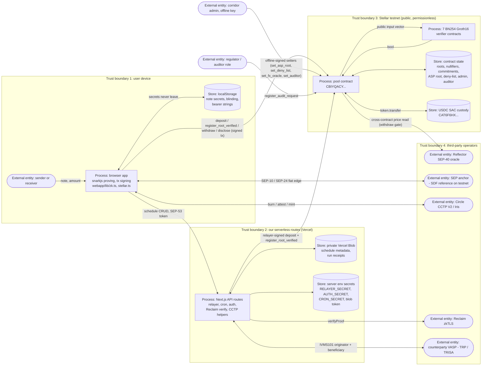

# Tukar Threat Model and Monitoring Plan

Status: testnet (Stellar testnet, Protocol 28 "Adapter"). Scope: the deployed testnet
system (15 Soroban contracts, of which the 8-contract core corridor of pool plus 7
verifiers is what the app transacts against, plus the Next.js app at
tukar-six.vercel.app). This document is the SCF #46 Tranche #2 threat model and
monitoring plan. It describes the security posture that actually exists in this
repository today, the mitigations that are in code, and the residual risk that remains.
It does not claim a professional audit, real users, or metrics the project does not
have. Where a control is planned rather than live, it is labeled.

It follows the structure SDF publishes for builders: the four threat-modeling questions
and the STRIDE template at
[developers.stellar.org/docs/build/security-docs/threat-modeling](https://developers.stellar.org/docs/build/security-docs/threat-modeling).

| SDF question | Where answered here |
|---|---|
| What are we working on? | Section 1 (system, data flow diagram, trust boundaries) and Section 2 (assets) |
| What can go wrong? | Section 3, with a STRIDE index at 3.0 |
| What are we going to do about it? | Section 3 per threat (mitigation in code plus residual risk) and Section 4 |
| Did we do a good job? | Section 6 retrospective |
| How would we detect it? | Section 5 monitoring plan, derived from Section 3 |

Ground truth for every claim below is the code in `contracts/pool/src/lib.rs` and the
`webapp/` server routes and libraries cited inline. The honest limits are the same
ones recorded in `README.md` and `docs/SECURITY.md`.

---

## 1. System overview and trust boundaries

Tukar is a privacy-pool remittance corridor. Fiat (or bridged USDC) enters at one
edge, crosses the corridor as a shielded transfer with the amount and counterparties
hidden on-chain, and exits as local fiat at the other edge. Zero-knowledge compliance
proofs run at the edges and selective-disclosure proofs answer a regulator without
revealing the payment graph.

There are four trust surfaces.

1. Client browser. Builds all zero-knowledge proofs client-side with snarkjs over
   WASM (`webapp/lib/zk.ts`, `webapp/lib/stellar.ts`). Note secrets, blinding factors,
   and bearer-note strings live only on the device (localStorage). The browser signs
   Stellar transactions either with the built-in throwaway testnet key or with a
   connected Freighter wallet. Secrets that matter for the pool never leave the device.

2. Next.js serverless routes (`webapp/app/api/*`). A small set of privileged server
   functions: the recurring relayer and cron (`/api/cron/recurring`, `/api/schedules`,
   `webapp/lib/relayer.ts`), wallet sign-in (`webapp/lib/auth.ts`), the Reclaim
   personhood verifier (`/api/reclaim/verify`, `webapp/lib/asp.ts`), and the CCTP
   attest/mint helpers (`webapp/lib/cctp.ts`). These hold server-only secrets
   (`RELAYER_SECRET`/`DEMO_SECRET`, `AUTH_SECRET`, `CRON_SECRET`, `BLOB_READ_WRITE_TOKEN`,
   `RECLAIM_PROVIDER_ID`) and are marked `import "server-only"` so they cannot be pulled
   into a browser bundle.

3. Soroban contracts. The pool (`CBIYQACY…`) custodies the USDC and holds the
   root / nullifier / commitment / leaf sets, the ASP allow-list root, the deny-list,
   and the admin and auditor roles. Seven BN254 Groth16 verifiers verify the transfer,
   compliance, disclosure, merkleUpdate, threshold, aggregate, and range circuits. The
   pool builds every verifier public-input vector itself from typed values; it never
   accepts a caller-supplied `Vec<Bn254Fr>`. This binding is the core security property
   (see the module doc comment in `lib.rs`).

4. External services. Reflector SEP-40 FX oracle (read cross-contract by the pool for
   the off-ramp quote and the settlement gate), the SEP anchor (SDF reference anchor on
   testnet, SEP-10/24), Circle CCTP V2 (bridge in/out), Reclaim (zkTLS proof of
   personhood), and an optional TRISA companion node for Travel Rule exchange. Each is a
   separate operator and a separate failure domain. The pool trusts none of them for
   fund safety beyond the specific, bounded roles described in Section 3.

### Data flow diagram

External entities are outside our control, processes are ours, stores hold data, and the
dashed boxes are the trust boundaries. A rendered architecture drawing of the same system
is at [`docs/architecture.svg`](architecture.svg).

### Data flow: a private send

1. Browser mints a note (secret, blinding, amount) locally and builds two proofs: a
   compliance proof (the authenticated depositor is in the ASP allow-list and not in the
   deny-list, bound to this commitment) and an amount-binding disclosure proof (the
   commitment opens to exactly the deposited amount).
2. Browser calls `pool.deposit(from, amount, commitment, proof, binding_proof)`. The
   pool checks the amount range, rejects a non-canonical or duplicate commitment,
   requires `from.require_auth()`, derives the compliance `sourceKey` as
   `field(from) = keccak256(from XDR) mod r` itself, verifies both proofs, then pulls
   the real tokens in with `token.transfer`.
3. Browser (or the server relayer for a recurring plan) advances the tree with
   `pool.register_root_verified(proof, old_root, new_leaf, new_root)`, where the leaf
   must already be a backed commitment, may be inserted at most once, and the proof's
   `leafIndex` is pinned to the contract's `LeafCount`. The note is now spendable.
4. To pay out at the far edge, the browser builds a transfer/withdraw JoinSplit proof and
   calls `pool.withdraw(...)`. The pool binds the released amount to the proof's negative
   `public_amount`, recomputes `ext_data_hash = keccak256(recipient || public_amount)` so
   the proof cannot be replayed to a different recipient, optionally enforces the oracle
   settlement gate, spends the nullifiers, then releases USDC.

The amount and the sender/recipient link are hidden on-chain across the transfer leg.
Deposits and withdrawals are visible at the edges by Privacy-Pools design.

### Data flow: a disclosure

1. A regulator (auditor role) optionally registers an audit request on-chain for the
   aggregate case: `register_audit_request(audit_context_hash)`, auditor-gated.
2. The holder builds a selective-disclosure proof in the browser (exact, threshold,
   two-sided range, or aggregate) that proves one fact about a commitment the pool
   already knows, without revealing the amount.
3. The pool verifies the proof on-chain (`disclose`, `disclose_threshold`,
   `disclose_range`, `disclose_aggregate`). For the aggregate case it additionally
   rejects any `auditContextHash` the auditor never registered, so a holder cannot
   report a cherry-picked subset. The verified fact is all that is revealed.

---

## 2. Assets to protect

- Shielded-pool USDC custody. The pool holds real testnet USDC (SAC `CAT6F6HX…`). The
  primary loss scenario is an unauthorized withdrawal or a drain via a forged proof,
  double-spend, or an unbacked leaf. This is the highest-value asset in the system.
- Note secrets and bearer notes. A note is a bearer instrument; its secret is the
  spend authority. These live only in the browser (localStorage) and in exported bearer
  strings the user holds. Compromise of a note secret means that note can be spent.
- The corridor admin key (`corredor`, public key `GB2CVRVNR4VN5LYVOX637ZS46RJONKWVQZ4IZC5IIEPAPPFRC5CHYRVS`,
  referenced as `SOURCE` in `webapp/lib/constants.ts`). This is the pool `Admin` (and the
  default `Auditor`). It gates every policy setter (Section 3). Its secret never enters the
  browser, but it was committed to this repository and pushed to a public remote, and it must
  therefore be treated as compromised. Section 3.5 discloses what leaked, when it was found,
  what a holder can and cannot do with it, and what the remedy is.
- The relayer / `DEMO_SECRET` testnet key. A funded, deliberately public throwaway key
  used so the no-install demo and the recurring relayer can sign real testnet writes. It
  is not the admin key and holds only free testnet value. Its exposure is by design and
  is not a real-funds risk on testnet, but it must never be reused for a production key.
- Server secrets. `AUTH_SECRET` (HMAC key for wallet sign-in nonces and tokens) and
  `BLOB_READ_WRITE_TOKEN` (private per-owner schedule store). Compromise of `AUTH_SECRET`
  would let an attacker forge session tokens for the scheduler; compromise of the Blob
  token would expose schedule metadata (never secrets, per Section 3).
- User PII. Tukar holds none. KYC and personal data live with the licensed anchor at the
  fiat edge, not in Tukar. On testnet the reference anchor performs no real KYC, so no PII
  is collected at all.

---

## 3. Threats and mitigations

Each item states the mitigation that exists in code and the residual risk honestly.

### 3.0 STRIDE index

Every STRIDE category has at least one identified issue. The id in the first column is
what Section 5 refers to when it names the signal that would detect the threat.

| STRIDE id | Issue | Detail |
|---|---|---|
| Spoofing.1 | Depositing as someone else's allow-listed identity | 3.3 |
| Spoofing.2 | Forging a cron or scheduler caller to drive the relayer | 3.6 |
| Spoofing.3 | Impersonating the settlement asset with a look-alike asset code | 3.11 |
| Tampering.1 | Forged or altered Groth16 proof accepted on-chain | 3.2 |
| Tampering.2 | Replaying a spent note (nullifier reuse, including non-canonical re-encoding) | 3.1 |
| Tampering.3 | Corrupting custodied state during the pool migration | 3.9 |
| Repudiation.1 | A holder answering an aggregate audit request with a cherry-picked subset | 3.12 |
| Repudiation.2 | A live-pool policy change leaving no on-chain event to reconcile against | 3.12 |
| InfoDisclosure.1 | Linking sender to receiver, or recovering an amount, from on-chain data | 3.13 |
| InfoDisclosure.2 | Server secrets or note secrets reaching the browser bundle or a third party | 3.10 |
| DoS.1 | Oracle staleness or a thin feed blocking off-ramp settlement | 3.4 |
| DoS.2 | Relayer key drained of fees, or the cron not running, stalling recurring sends | 3.6, 3.14 |
| ElevationOfPriv.1 | Admin-key compromise re-pointing the ASP root, deny-list, or FX oracle | 3.5 |
| ElevationOfPriv.2 | Auditor role misuse to register arbitrary audit contexts | 3.12 |

### 3.1 Double-spend and nullifier reuse
Mitigation (live). Every spend records the nullifier in a persistent set
(`spend_nullifiers` in `lib.rs`); a second spend of the same nullifier reverts with
`NullifierUsed` (#2). Nullifiers double as storage keys, so any caller-supplied field
element is required to be the canonical reduced-mod-r encoding (`require_canonical`).
This closes the non-canonical-nullifier bypass: `Bn254Fr::from_bytes` silently reduces
mod r, so `n`, `n+r`, `n+2r` all feed the same verifier input but would otherwise be
distinct storage keys; a spent nullifier replayed as `n+r` would miss the double-spend
check. The guard rejects any non-canonical input with `NonCanonicalField` (#14). Spent
markers are TTL-extended to match the roots and leaves they guard, so a nullifier cannot
expire and be archived while its note remains provable. The transfer/withdraw
input/output counts are pinned (`TRANSFER_NINS`/`TRANSFER_NOUTS`) so a caller cannot
shift the nullifier-vs-commitment boundary in the flat public vector to spend one fewer
nullifier. Verified live: a cross-wallet double-spend is rejected on-chain
(`test:e2e`).
Residual risk. Correctness depends on the nullifier derivation in the transfer circuit
and on the canonical-encoding guard covering every field element used as a key. Both are
covered by the current tests and the guard, but neither has a professional audit.

### 3.2 Forged or tampered proofs
Mitigation (live). Every proof is verified on-chain by the corresponding Nethermind-style
BN254 Groth16 verifier. `Pool::verify` does not rely on the verifier trapping; it also
asserts the returned boolean, so a verifier that returns `false` can never make a check a
no-op (`ProofRejected`, #7). The pool builds each public-input vector from typed values in
circuit order, so a valid proof cannot be presented against different nullifiers,
commitments, root, or amount. Verified live: a tampered proof returns `InvalidProof`.
Residual risk. Soundness rests on Groth16 over BN254 and on the trusted setup (Section 4).
No custom cryptographic primitive is introduced, but the circuits are not independently
audited.

### 3.3 Sanctioned or unauthorized deposit
Mitigation (live). `deposit` requires `from.require_auth()` and verifies a compliance
proof whose public inputs are `[aspRoot, deny0..7, sourceKey = field(from), bindHash = commitment]`.
The pool derives `sourceKey` itself from the authenticated depositor, so the proof shows
that this specific depositor is in the allow-list and not in the deny-list; it cannot be
satisfied with someone else's membership witness. The allow-list root and the 8-entry
deny-list are on-chain policy the admin can re-point without a redeploy.
Residual risk. The allow-list is only as good as the process that populates it. On the
public demo the shared demo key is allow-listed so the no-install flow works, which means
the demo itself is not access-controlled even though the design is correct for real
wallets. A production corridor needs a licensed anchor's KYC feeding the allow-list.

### 3.4 Oracle manipulation or stale price
Mitigation (live). The withdraw settlement gate prices against the median of the last 5
Reflector records (`quote_local_median`, `FX_GATE_RECORDS = 5`), not a single spot price,
so one manipulated or glitched record cannot move the floor. The feed must return at least
`FX_MIN_RECORDS = 3` records, and every record must be fresh within `FX_MAX_STALENESS = 3600`
seconds, or the read fails closed with `FxUnavailable` (#11). The gate runs after proof
verification but before nullifiers are spent, so a withdraw rejected for slippage burns no
nullifier and can be retried when the rate recovers. A plain withdraw with no gate settles
in USDC and never depends on the oracle. The display quote (`offramp_quote`) also fails
closed on a stale or absent feed rather than trapping.
Residual risk. The median defends against a single-record outlier, not against a sustained
compromise of the Reflector feed across all recent records. The gate protects fund release;
the display quote for corridors without an oracle falls back to a public FX API, which is a
weaker source and is display-only.

### 3.5 Admin-key compromise

Known compromise, disclosed. This threat is not hypothetical here. The `corredor` admin SECRET
was hardcoded in four tracked scripts and pushed to a public GitHub remote on both `main` and
`dev`. It entered the repository in commit `a6b44a0` (2026-08-14, the migration tooling) and
spread to `409ad22`, `adb4ef6` and `46ee560` (the accumulator, reserves-aggregate and timelock
end-to-end scripts). It was found on 2026-09-11 and removed from the working tree in `a647609`;
those four scripts now read `process.env.CORREDOR_SECRET` and exit without it. Removing it from
the tree does not remove it from history, and a public repository can already have been cloned,
forked or cached, so the key is compromised and stays compromised until the corridor moves off
it. The public key `GB2CVRVNR4VN5LYVOX637ZS46RJONKWVQZ4IZC5IIEPAPPFRC5CHYRVS` is unchanged and
is still the admin of the live pool. `docs/KEY-ROTATION.md` in the repository carries the full
analysis and the operator runbook. That runbook is deliberately not published on the
documentation site, because live admin rotation commands do not belong on a public page; the
fact of the leak does, which is why it is stated here.

Blast radius, bounded. Verified by reading `contracts/pool/src/lib.rs` rather than assumed. On
the live pool `CBIYQACYOKDBPYDGU7DMSHPGJEWP2ZRETXDVOTC5HTU5RJBGDK2MHTWJ` a holder of the key can
call exactly eight functions: `set_asp_root` and `set_deny_list` (who may deposit),
`set_auditor`, `set_fx_oracle`, the three disclosure verifier setters `set_threshold_verifier`,
`set_aggregate_verifier` and `set_range_verifier`, and `register_audit_request`. What the holder
cannot do is what bounds the damage. The four core verifiers (transfer, compliance, disclosure,
merkleUpdate) are written once at `__constructor` and have no setter, so the proofs that move
money cannot be repointed at a permissive contract. There is no admin withdraw, no mint and no
pause, and the trustless tree removed the admin root-override, so there is no path to forge a
root or mint a leaf. This is a testnet deployment holding testnet USDC, so no real money can be
stolen with this key. The realistic worst case is compliance settings or a disclosure verifier
changed underneath a reviewer who is checking the contracts on an explorer. That is a
credibility problem, not a fund-safety one.

Why it cannot simply be rotated in place. The live pool has neither `upgrade` nor `set_admin`.
Its admin was fixed at deployment and no code path changes it. Across the rest of the
deployment: `pool-enforced` and `pool-accumulator` have `upgrade` but no `set_admin`, so
rotation means upgrading to a wasm that has a setter, or redeploying; `pool-timelock` has a
timelocked `set_admin` (`propose_set_admin`, wait out the delay, `execute_set_admin`) and is the
one contract that handles this properly, which is that design decision doing exactly the job it
was written for; `policy-registry`, `reserves` and `reserves-aggregate` have neither hook and can
only be redeployed under a new key, which produces new contract ids.

Remedy. The complete fix is migrating the live corridor onto the upgradeable pool under a fresh
key. That is deliverable D1.3 of the SCF build proposal, and this leak is the evidence that the
deliverable matters. The tooling exists and is proven against a test double (`import_state`,
`scripts/migrate-pool.mjs`, Section 3.9); executing it on the live corridor changes the
corridor's contract address and every explorer link that points at it, which is why it is a
tranche of funded work rather than a patch. The partial remedies available without it are
rotating `pool-timelock` through its own timelock and redeploying the three no-hook contracts
under a new key. Until the migration runs, the live corridor runs on a compromised admin key,
and this section exists so a reviewer learns that from the project rather than from the commit
log.

Mitigation (live). The admin is the corridor `corredor` public key and never the demo key. Every
policy setter is admin-gated with `require_auth`:
`set_asp_root`, `set_deny_list`, `set_fx_oracle`, `set_auditor`, and the additive verifier
setters. The trustless tree removed the admin root-override, so the root advances only via
`register_root_verified` with a valid merkleUpdate proof; there is no admin backdoor to mint
a root or a leaf. Operator admin writes in the app build an offline-signed command, so the
admin key never enters the browser.
Mitigation (preview). An admin timelock now ships on a preview-track pool
(`contracts/pool-timelock`, `CDTE5CHIKXNJLTCJFBV6F3HLVD2B2GGYZ7NFTDW24DCQNK6F63H56FJ2`). It puts
the five compliance-critical setters (`set_asp_root`, `set_deny_list`, `set_fx_oracle`,
`set_auditor`, `set_policy_registry`) behind propose then a mandatory delay then execute, with
cancel and pending views. The instant setter is removed on that track, so a stolen admin key can
no longer flip the allow/deny controls in one transaction; a change is visible as a pending
proposal for the whole delay before it can apply. This is e2e-proven on-chain (propose, an
over-early execute rejected with `TimelockNotReady` (#20), an after-eta execute applied, and
cancel) and in cargo (`pool-timelock` 89/89, timestamp-controlled before/after-eta tests).
Residual risk. The live pool's admin key is known to be compromised, per the disclosure at the
top of this section, and its setters are still instant because the timelock is on the preview
track. So a holder could re-point the ASP root or deny-list (change who may deposit) or the FX
oracle address in one transaction today. It cannot forge a root, mint a leaf, or move custodied
funds directly. What remains is applying the timelock to the live pool via the state migration
(Section 3.9) under a fresh admin key, and pairing that admin with a Stellar multisig account (an
account-config step, not code).

### 3.6 Relayer abuse in recurring sends
Mitigation (live). The cron endpoint (`/api/cron/recurring`) authorizes with a constant-time
SHA-256 comparison of the bearer against `CRON_SECRET` and fails closed if the secret is
missing or shorter than 16 characters, so `Bearer undefined` never passes. The scheduler API
(`/api/schedules`) requires a wallet sign-in token (SEP-53, `webapp/lib/auth.ts`) and derives
the owner from the token, never from the request body, so a caller can only touch its own
plans. Per-owner caps bound abuse: `MAX_AMOUNT_USDC = 100` per plan and `MAX_ACTIVE_PLANS = 25`
per owner. The store is a private per-owner Vercel Blob (`access: "private"`, no public URL)
that holds only plan metadata and per-run receipts, never a note secret, key, or blinding
(`webapp/lib/schedules.ts`). The relayer only calls `pool.deposit` and
`register_root_verified` against the existing pool; it never uses the admin key and never
redeploys (`webapp/lib/relayer.ts`). It signs with `RELAYER_SECRET`, falling back to the
public testnet `DEMO_SECRET`. Transient faults (sequence race, testnet load-shedding) are
retried; a deterministic contract revert is never retried. A failed deposit leaves the plan
due so the next run retries rather than silently skipping a payment.
Residual risk. The relayer signs with a testnet key by design, so on mainnet this key must be
a properly managed hot key with its own spend limits and monitoring. The per-plan cap is a
demo bound, not a policy engine. The owner path is regex-validated against path traversal, but
the Blob token, if leaked, would expose schedule metadata for all owners.

### 3.7 CCTP bridge risk
Mitigation (live). The inbound and outbound legs use Circle's own contracts, separate from
Tukar's contracts (`webapp/lib/cctp.ts`). The Stellar burn is signed by the connected wallet
(or the demo key), and the EVM burn is signed by the user's own EVM wallet, so Tukar never
moves a user's bridged value without a user signature. The mint / receive leg is permissionless
by design (`destinationCaller` zeroed), so anyone can relay the attested message; this is safe
because the recipient is fixed in the burn's hook data. The server attestation poller maps a
not-yet-indexed message (Iris 404 or any incomplete status) to `pending` so the client re-polls
rather than seeing a 500.
Residual risk. CCTP trusts Circle's attestation service; a Circle outage stalls transfers.
Native USDC mint on Stellar requires the recipient to hold a USDC trustline, or the mint fails.
Bridge encodings are verified against Circle's reference examples but not audited here. This is
a wired integration on testnet, and the outbound burn leg needs a user EVM wallet.

### 3.8 Personhood and allow-list loop
Mitigation (live). `/api/reclaim/verify` re-verifies the Reclaim zkTLS proof server-side with
`verifyProof`; the client is never trusted to assert it verified. The provider id comes from
`RECLAIM_PROVIDER_ID` (env), not the request body, so a caller cannot point verification at an
arbitrary provider. On success the server computes the allow-list update
(`computeAllowlistUpdate`, `webapp/lib/asp.ts`): it recomputes the new Poseidon root and the
operator's `set_asp_root` CLI, but it never signs. The admin applies the write with their own
key. The helper first checks that the stored witness leaves reproduce the recorded `aspRoot`
before appending, and self-checks that the appended leaf folds back to the new root. No admin
secret is used or held server-side.
Residual risk. A verified person is not on-chain until the operator applies `set_asp_root`, so
there is an off-chain human step between verification and allow-listing (deliberate, keeps the
admin key out of the server). Personhood via Reclaim is not full KYC; a production corridor
composes a licensed KYC provider.

### 3.9 Migration risk
Mitigation (live and preview). The global ASP allow-root and deny-list are the enforced policy
on the live pool. Per-corridor on-chain cap enforcement exists on a separate preview-track pool
(`POOL_ENFORCED` in `constants.ts`) that reads the on-chain policy registry and reverts an
over-cap withdrawal, plus an admin-only in-place `upgrade`. The live pool has no upgrade hook, so
moving per-corridor enforcement onto it is a state migration, not a flag flip.
Residual risk. A production migration of custodied state carries the usual one-shot import risk
and must preserve nullifier completeness so no spent note can be replayed across the migration.
This is called out as future work and is not yet exercised on the live pool.

### 3.10 Web and serverless risks
Mitigation (live). All privileged logic is server-only (`import "server-only"` on `relayer.ts`,
`auth.ts`, `schedules.ts`), so secrets never reach the browser. Proving is client-side and
secrets stay on the device. Wallet sign-in uses domain-separated HMAC (nonce vs token) with
`timingSafeEqual` and fails closed. The app is a Next.js server deployment on Vercel. The
`headers()` block in `next.config.mjs` now sets a Content-Security-Policy on every route with an
explicit origin allowlist (the Soroban testnet RPC and Reflector, the FX fallback, friendbot, the
CCTP Base Sepolia RPC, the off-ramp quote host, and Reclaim), plus `X-Frame-Options: SAMEORIGIN`,
`X-Content-Type-Options: nosniff`, and `Referrer-Policy`. The CSP was tuned to what the app
actually loads and verified with zero violations across all pages while live reads stayed intact
(`scripts/qa-csp.mjs`).
Residual risk. The CSP keeps `'unsafe-inline'` for scripts and styles (Next.js hydration inline
scripts and Tailwind/Next inline styles) and allows `'wasm-unsafe-eval'` plus a `blob:` worker
source for in-browser snarkjs proving, so it is not a nonce-strict policy. The browser demo loads
snarkjs and circomlibjs from a public ESM CDN (esm.sh), which is an external code dependency at
runtime.

### 3.11 Settlement-asset impersonation (Spoofing.3)
Mitigation (live). Nothing in the system resolves the settlement asset from a bare asset
code. The pool stores the token as a Soroban `Address` at initialisation
(`DataKey::Token`, `contracts/pool/src/lib.rs`) and every transfer goes through
`TokenClient::new(env, &addr)` on that stored contract id, so the custodied asset is the
USDC SAC `CAT6F6HX4B2DBPSS4SIZ257IYSMKDKRJSEGIQTKBDS7LOFRMDXVGFVA2` and cannot be swapped
by a caller. The app pins the classic side by issuer as well as code
(`USDC_ISSUER = GC7SWGHRQLMP4SW2AOBRSC2HFKVPNPHBH5A3PX3ZDVEJFMYKLWQ3SY3B`,
`webapp/lib/constants.ts:14`), and the monitoring reader filters token events by the same
SAC contract id (`POOL_TOKEN`, `webapp/lib/anomaly.ts`). Asset-code collision is a live
problem on Stellar generally: a testnet search for a popular stablecoin code returns many
assets from unofficial issuers, some copying the real asset's `auth_revocable` and
`auth_clawback_enabled` flags. Contract-id and issuer pinning is the correct defence and
it is what the code already does.
Residual risk. The defence is only as good as the constant. A wrong contract id at
deployment or in a future config change would custody the wrong asset, so the deployed
token address is part of the deployment checklist and is displayed in the operator
console's contract inventory for reconciliation.

### 3.12 Repudiation and the audit trail (Repudiation.1, Repudiation.2, ElevationOfPriv.2)
Mitigation (live). For the aggregate disclosure the pool rejects any `auditContextHash`
the auditor never registered via `register_audit_request`, so a holder cannot answer a
"sum of everything" request with a subset they chose themselves; the request and the
answer are both on-chain and bound to each other. Ordinary spends are non-repudiable by
construction: a nullifier is recorded permanently and a withdraw binds
`ext_data_hash = keccak256(recipient || public_amount)` so the recipient and amount of a
release cannot later be disputed.
Residual risk, and this one is a real gap. The live pool emits events for only four
actions: `(deposit, index)`, `(withdraw, recipient)`, `(transfer,)`, and `(root, new_leaf)`
(`env.events().publish` at four sites in `lib.rs`). `set_asp_root`, `set_deny_list`,
`set_auditor`, `set_fx_oracle`, and `register_audit_request` emit nothing. A policy change
is therefore visible only as a transaction on the admin account, not as a contract event,
so an event-based watcher alone cannot reconcile it. The preview-track contracts do better
(the policy registry emits `(policy, corridor)` and the timelock emits
`(tl_prop | tl_exec | tl_cancel, setter)`), which is why Section 5 watches the admin
account directly for the live pool and treats adding events to the live setters as work,
not as an existing control. The auditor role is a single key and is the admin by default;
splitting it is production hardening.

### 3.13 Linkability and metadata leakage (InfoDisclosure.1)
Mitigation (live). The amount and the sender-to-recipient link are hidden on-chain across
the transfer leg: the pool stores commitments and nullifiers, and the JoinSplit proof
reveals only a root and a signed `public_amount`. Note secrets and blinding factors never
leave the device. Deposits and withdrawals are visible at the edges by Privacy-Pools
design, which is deliberate and is what makes compliance provable.
Residual risk. Privacy is statistical, not absolute. A small anonymity set links a deposit
to a withdraw by timing and amount, and today the pool has no real traffic, so the
anonymity set is small enough that an observer can often correlate the two edges. The app
shows the current anonymity set so a user is not misled about this. The depositor address
is not in the `deposit` event but is recoverable by joining the USDC SAC `transfer` event
on the same transaction hash, which is exactly what the operator console does; an
adversary can do the same. Relayer-submitted recurring deposits all originate from one
key, which groups those payments together.

### 3.14 Corridor availability (DoS.2)
Mitigation (live). The withdraw settlement gate fails closed rather than settling on a bad
price (3.4), and a gate rejection burns no nullifier so the user retries. The recurring
relayer retries transient faults and leaves a failed plan due rather than silently
skipping it, and each cron invocation returns a structured JSON receipt. Both cron routes
are wrapped in a Sentry cron monitor (`Sentry.withMonitor("recurring-deposit", ...)` in
`webapp/app/api/cron/recurring/route.ts` and `Sentry.withMonitor("push-watches", ...)` in
`webapp/app/api/cron/push/route.ts`), which reports a missed or failing run.
Residual risk. The Sentry monitors only report when a DSN is configured:
`sentry.server.config.ts` gates `Sentry.init` on `NEXT_PUBLIC_SENTRY_DSN`, which is unset
today, so the wiring exists and the alerting does not yet. Setting the DSN is a
configuration step and is listed in Section 5 as such. Beyond that, the corridor depends on
Soroban RPC, Vercel, the anchor, and Reflector; none of them is under our control and each
is a separate availability domain. The relayer account must stay funded or recurring runs
fail for lack of fees.

---

## 4. Known limitations and residual risk

These are the honest limits, consistent with `README.md` and `docs/SECURITY.md`.

- Not professionally audited. The system was hardened through repeated adversarial self-audit
  rounds, not an external audit. Do not use with real assets.
- Trusted setup. A runnable multi-party phase-2 ceremony has been run and verified for all eight
  circuits and its keys are the deployed keys, but the demo ran all rounds on one machine to prove
  the process. The one-honest-party soundness guarantee needs genuinely independent contributors,
  which a production ceremony provides.
- Reference anchor is not licensed. The SEP calls are real (SEP-1, SEP-10, SEP-12, SEP-24, and
  SEP-38 firm quotes), but on testnet they run against SDF's reference anchor, whose SEP-12
  customer flow accepts three fields and returns ACCEPTED with no review, so no real KYC and no
  real bank movement happens at the fiat edges. Going live requires a licensed KYC anchor (a
  business step, not a code step).
- Full-pool proof-of-reserves is live and exact via a liability accumulator that folds +amount on
  deposit and -released (the public, proof-bound off-ramp amount) on withdraw, so the on-chain total
  equals the exact live outstanding liabilities and `attest_reserves` needs no depositor opening
  witnesses at read time. Applying it to the live pool needs the state migration; the accumulator
  ships on the preview track.
- Live-pool per-corridor enforcement needs a migration. It ships on a preview track because the
  live pool has no upgrade hook.
- Testnet only. No users and no revenue yet. Metrics in Section 5 are the plan to implement, not
  a claim of collected data.
- A Content-Security-Policy and baseline security headers now ship on all routes (Section 3.10).
  An admin timelock on the privileged setters now ships on the preview-track pool
  (`contracts/pool-timelock`, propose then delay then execute on the five compliance setters,
  e2e-proven); what remains is applying it to the live pool via the migration and pairing the admin
  with a Stellar multisig account. The relayer / demo key are intentionally public testnet keys;
  these remain production hardening items.

---

## 5. Monitoring plan

This plan is derived from Section 3: every signal below names the STRIDE id it is there to
detect. It distinguishes what runs today from what Tranche #2 builds, and it only names
signals this system actually produces. The authority for "what is observable" is
`webapp/lib/anomaly.ts`, which decodes the events the deployed contracts really emit.

### 5.1 What the contracts actually emit

The live pool (`contracts/pool/src/lib.rs`) publishes exactly four events:

| Topics | Data | Emitted by |
|---|---|---|
| `(deposit, index)` | `(commitment, amount)` | `deposit` |
| `(withdraw, recipient)` | `amount` | `withdraw` |
| `(transfer,)` | `root` | shielded transfer |
| `(root, new_leaf)` | `new_root` | `register_root_verified` |

There is no depositor address in the `deposit` event; it is recovered by joining the USDC
SAC `transfer` event with the pool as destination on the same transaction hash. The live
pool's policy setters (`set_asp_root`, `set_deny_list`, `set_auditor`, `set_fx_oracle`) and
`register_audit_request` emit **no** events at all, which is the gap recorded in 3.12. On
the additive contracts the policy registry emits `(policy, corridor)` with
`(cap_usdc, disclosure)` and the preview timelock pool emits
`(tl_prop | tl_exec | tl_cancel, setter)`.

A reverted transaction publishes no contract events. Every error-rate signal below
(`ProofRejected`, `NullifierUsed`, `NonCanonicalField`, `SlippageExceeded`, `FxUnavailable`)
therefore has to come from transaction results, not from `getEvents`. `webapp/lib/txmon.ts`
now reads them there. What the two public APIs give, measured against testnet on 2026-09-11:

- **Soroban RPC `getTransactions`** returns every transaction in a ledger range with no contract
  or account filter. A page of 200 covers about 16 ledgers and takes about 2 s, so the ~7-day
  retention window is roughly 7,500 pages. Unusable as a scan.
- **Soroban RPC `getTransaction(hash)`** returns `diagnosticEventsXdr`, which carries the exact
  contract error code and the contract that raised it (`topics [symbol "error", error {contract: N}]`),
  including a sub-invoked verifier. `getTransactions` does **not** return it. Only inside the RPC
  retention window; an older hash answers `NOT_FOUND`.
- **Horizon `/accounts/{id}/transactions?include_failed=true`** indexes by **account**, not by
  contract, for all history. It returns the envelope and the transaction result, but no meta, so
  the coarse failure (`trapped`, `resource_limit_exceeded`) survives forever and the error code
  does not.

So the recoverable design is: discover by account on Horizon, then ask the RPC for the code while
the transaction is still in retention. That covers every account this corridor transacts with
completely. It does **not** cover a reverted invocation submitted by an arbitrary third party,
because no public API indexes transactions by contract, and it does not keep error codes past the
RPC window. Those two are what the Tranche #2 indexer is for, and they are now a narrow gap rather
than the whole signal.

### 5.2 Live now

- **Operator monitoring console.** `/operator` then Monitoring (`webapp/app/operator/page.tsx`,
  `MonitoringSection`) calls `readMonitoringWindow()` in `webapp/lib/anomaly.ts`: one
  paginated `getEvents` with four filters (the pool, USDC SAC transfers into the pool, the
  policy registry, the preview timelock pool), starting at `getHealth().oldestLedger`, so
  it covers the whole RPC retention window, about 7 days on public testnet. Pages are capped
  at 10 pages of 1000 and the result carries `truncated` when the tail was cut. It is
  read-only RPC simulation and needs no key.
- **Deposit velocity.** `velocity()` buckets deposits into the last 24 hours by hour and the
  whole window by UTC day, with count and USDC per bucket. This is the baseline any threshold
  below will eventually be tuned against.
- **Near-cap structuring heuristic.** `nearCap()` flags deposits sitting within 10% below a
  corridor cap but under it, tested against every distinct cap read from the policy registry
  because the `deposit` event carries no corridor.
- **Repeated-actor heuristic.** `repeatedActors()` reports depositors with at least N deposits
  inside a rolling 24-hour window, and separately counts deposits whose depositor could not be
  attributed.
- **Admin-event view.** `adminEvents()` surfaces policy-registry writes and timelock
  propose / execute / cancel, newest first. Note the limitation above: this covers the
  additive contracts, not the live pool's own setters.
- **Transaction-level read.** `readTxMonitoring()` in `webapp/lib/txmon.ts` reads the watched
  accounts (the operator key, the relayer / demo key, and the pool's `auditor()` read live so the
  watch follows a `set_auditor` change) from Horizon with `include_failed=true`, keeps the
  transactions whose top-level invocation hits a watched contract, and fills in the exact contract
  error for the failures still inside RPC retention. Verified live on 2026-09-11 against a
  deliberately reverted `withdraw` (`amount = 0`, which panics `InvalidAmount` before touching
  state): tx `3809e755…b17593` decodes to `InvalidAmount (#5)` on `CBIYQACY…`, and the older
  `046163a9…48f104` shows the coarse `Trapped` with `error code aged out of RPC retention`.
- **Admin setter detection without events.** 3.12 says the live pool emits nothing from
  `set_asp_root`, `set_deny_list`, `set_auditor` or `set_fx_oracle`. The function name is still in
  the transaction envelope, so the transaction-level read recovers it. The console currently shows
  a real `set_auditor` on the live pool found this way.
- **Alert transport.** `webapp/lib/op-alerts.ts` pushes Critical and Warning findings out of the
  browser over the Web Push already implemented here (VAPID, `public/sw.js`, no new channel). An
  operator subscribes from the Monitoring sheet; the sweep runs inside `/api/cron/push`. Verified
  end to end on 2026-09-11: three real findings delivered to a real Chrome push subscription, and
  the next sweep sent nothing (dedup is per subscription, so a new operator gets the standing
  findings once).
- **Sentry cron monitors.** `Sentry.withMonitor("recurring-deposit", ...)` and
  `Sentry.withMonitor("push-watches", ...)` wrap the two cron routes, and `lib/log.ts`
  supplies shared sampling, PII and secret-scrubbing options. These are wired but inert:
  `sentry.server.config.ts` gates `Sentry.init` on `NEXT_PUBLIC_SENTRY_DSN`, which is not set
  today, so no events are transported. Setting the DSN is a configuration step, listed in 5.5.
- **Structured cron receipts.** Each invocation returns `processed`, `pending`, `depHash`,
  `depositOk`, `regOk`, `error`, and each plan keeps its last 20 run receipts.
- **Vercel Web Analytics and Speed Insights.** Integrated in `webapp/app/layout.tsx`; page
  traffic and Core Web Vitals once traffic exists.

### 5.3 Signals, thresholds and response

Severities follow SDF's published examples (Info, Warning, Critical). Thresholds marked
"baseline pending" have no number yet on purpose: there is no real traffic to tune against,
and inventing one would be worse than saying so. They are set during the Tranche #2 pilot, and
`THRESHOLDS` in `webapp/lib/txmon.ts` carries `value: null` for each of them so the console
renders "unset, no baseline" rather than a plausible-looking number. The rules that ARE set are
set because they hold at any volume: a reverted invocation means an on-chain guard fired, and a
compliance-critical setter by the operator key is rare and high-privilege by definition. Neither
needs a denominator.

| Signal | Detects (STRIDE id) | Source | Severity | Response |
|---|---|---|---|---|
| Pool USDC balance falls without a matching `withdraw` event | Tampering.1, Tampering.2 | `balance()` reconciled against summed `withdraw` events | Critical | Page. Halt the operator flow, reconcile every withdraw in the window |
| `NullifierUsed` (#2) or `NonCanonicalField` (#14) on any watched account | Tampering.2 | `txmon.evaluate` on transaction diagnostics (live) | Critical | Alert on the first occurrence, no rate needed. A replay attempt against the double-spend guard |
| `ProofRejected` (#7) or `UnknownRoot` (#1) on any watched account | Tampering.1 | `txmon.evaluate` on transaction diagnostics (live) | Critical | Alert on the first occurrence. Tampering, or a key or artifact mismatch |
| A compliance-critical setter succeeding from the admin key | ElevationOfPriv.1, Repudiation.2, 3.12 | Transaction envelope function name (live) | Critical | Alert on every occurrence and reconcile against an expected change. This is the only on-chain record, since the live pool emits no event for these calls |
| `tl_prop` / `tl_exec` / `tl_cancel` on the timelock pool | ElevationOfPriv.1 | Timelock pool events (live) | Warning | Reconcile the proposed setter and eta against an expected change. An unexpected proposal is the compromise signal, and the delay is the response window |
| `(policy, corridor)` write on the policy registry | ElevationOfPriv.1 | Policy-registry events (live) | Warning | Reconcile the cap and disclosure change against an expected operator change |
| `register_audit_request` by the auditor | ElevationOfPriv.2 | Auditor account transaction history (live; the call emits no event) | Info | Log and reconcile against a real regulator request |
| `FxUnavailable` (#11) on a gated withdraw | DoS.1 | `txmon.evaluate` on transaction diagnostics (live), cross-checked against Reflector freshness directly | Warning | Off-ramp settlement is failing closed. Check the Reflector feed. No funds are at risk |
| `SlippageExceeded` (#12) | DoS.1 | `txmon.evaluate` on transaction diagnostics (live) | Info | Expected under FX movement. Console-only, never alerted |
| A reverted invocation whose error code has aged out of RPC retention | coverage gap | Horizon transaction result (live) | Warning | The coarse host result is all that survives past the RPC window. Reported as "aged out", never as "no error" |
| Deposit velocity outside the rolling baseline | Spoofing.1, InfoDisclosure.1 | `velocity()` (live) | Warning | Baseline pending. Investigate the contributing actors |
| Deposits clustered just under a corridor cap | Spoofing.1 | `nearCap()` (live) | Warning | Structuring heuristic. Review with the anchor's KYC signal, not in isolation |
| One depositor with many deposits in 24h | Spoofing.1 | `repeatedActors()` (live) | Info | Expected during testing. Meaningful once real corridor traffic exists |
| Relayer account XLM or USDC below a low-water mark | DoS.2 | Account balance of the relayer key | Warning | Top up before recurring runs start failing for fees |
| Cron run missed or failing | DoS.2 | Sentry cron monitor (needs a DSN) plus the run receipts | Warning | A missed schedule or a route error |
| A plan failing several consecutive runs | DoS.2 | Per-plan run receipts | Warning | The plan stays due and retries; repeated failure means a real fault |
| 401 rate on `/api/schedules`, rejected sign-ins | Spoofing.2 | Route logs | Warning | Token-forgery attempts or an `AUTH_SECRET` misconfiguration |
| CCTP attestation never completing within the expected window | DoS.2 | Attest poller poll count and time-to-complete | Warning | A Circle outage or a mis-encoded burn |
| Deployed token address differing from the expected USDC SAC | Spoofing.3 | Operator console contract inventory | Critical | Wrong settlement asset. Stop and reconcile the deployment |
| `truncated: true` on the monitoring window | coverage gap | `readMonitoringWindow()` (live) | Info | The window was cut at the page cap. Raise the cap or narrow the window before trusting the counts |

### 5.4 Coverage gaps, stated plainly

- **Alert cadence, not existence.** Alerts now leave the browser over Web Push, verified end to
  end. What is missing is frequency: the sweep rides `/api/cron/push` because the current hosting
  plan allows two daily crons and both are taken, so a Critical finding arrives in a daily digest,
  not within minutes. A row that says "page" still means a minute-scale schedule, which is a plan
  change rather than a code change. The console says this in the same words.
- **Reverted invocations by accounts we do not know.** Discovery is by account, because neither
  Horizon nor Soroban RPC indexes transactions by contract. Every account this corridor transacts
  with is covered; a reverted call against the pool from an unrelated third party is not seen.
  That is the indexer.
- **Error codes past the RPC window.** `diagnosticEventsXdr` only exists inside the ~7-day RPC
  retention. Older failures keep the coarse `trapped` from Horizon forever, and the console labels
  them "aged out of RPC retention" rather than "no error". Keeping codes longer needs the
  indexer's own store.
- **No revert RATE.** A rate needs a denominator over all callers, which is the same missing
  contract index. `revert-rate` is listed in `THRESHOLDS` as unset for exactly this reason.
- The live pool's own policy setters still emit no events (3.12). The function name in the
  transaction envelope now recovers the change, which is a real detection, but it is account
  scoped: a setter call from a key we do not watch would be missed. Adding events to those setters
  in the Tranche #1 migration is still the right fix.
- **Every rate threshold is unset.** There is no real traffic and no users, so there is no
  baseline. This is stated in code (`value: null`) and rendered in the console rather than filled
  in with a plausible-looking number.

### 5.5 Tranche #2 monitoring work

1. Set `NEXT_PUBLIC_SENTRY_DSN` so the two cron monitors and the error pipeline actually
   transport, and add alert rules for missed runs.
2. Build the transaction-level indexer. Two things only it can do, both now narrow and named:
   index invocations by **contract** rather than by account, so a reverted call from any caller is
   counted, and keep contract error codes past the RPC retention window so a rate has a history.
   The decoding is done and tested (`webapp/lib/txmon.ts`); the indexer supplies the feed.
3. Move Critical findings onto a minute-scale schedule. The transport is built and delivering; the
   cadence needs a cron plan that allows more than two daily runs, or an external scheduler.
4. Add events to the live pool's policy setters in the Tranche #1 migration, so the setter watch
   stops depending on knowing the submitting account.
5. Tune every "baseline pending" threshold against the pilot traffic in Tranche #2, and
   re-tune against the real baseline after the Tranche #3 mainnet launch.

---

## 6. Did we do a good job?

The retrospective SDF's template asks for, answered honestly.

- **Did the diagram help find issues?** Yes. Drawing the trust boundaries is what surfaced
  that the live pool's policy setters emit nothing (3.12), which invalidated an earlier
  version of this monitoring plan that claimed policy changes could be alerted on from
  contract events. That claim is now corrected.
- **Did we find issues we did not already know about?** Two. The setter-event gap above, and
  the fact that reverted transactions are invisible to `getEvents`, which moved every
  error-rate signal from "planned indexing" onto a different data source.
- **Are the treatments adequate?** For fund safety, the on-chain mitigations are in code and
  tested (double-spend, canonical encoding, proof binding, oracle fail-closed). For admin
  compromise on the live pool they are not yet: the timelock is on the preview track and
  applying it is Tranche #1 work, and this document says so rather than implying otherwise.
  Detection improved: reverted invocations are read and decoded, the setter gap in 3.12 is
  partly closed from transaction envelopes, and alerts leave the browser. What is left is cadence
  and coverage of callers we do not know, both stated in 5.4.
- **What would improve the next pass?** A professional audit, which is planned separately
  through the Audit Bank and is not funded by this proposal. A real traffic baseline, which
  the Tranche #2 pilot produces. And re-running this exercise after the Tranche #1 migration,
  since the migration changes the contract that most of Section 3 describes.
